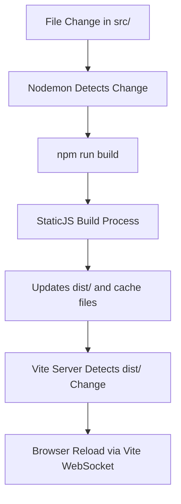
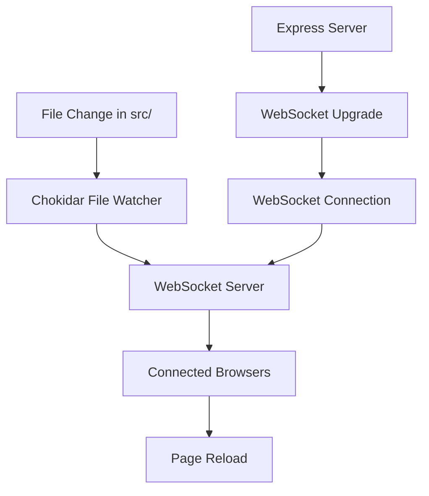
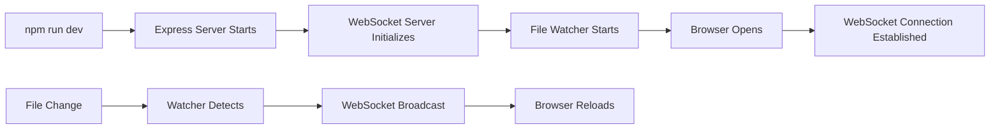

# WebSocket-Based Hot Reloading Architecture Design

## Current Architecture Analysis

### Identified Complexity Issues

The current React template has a complex two-stage development system:

1. **Complex Script Chain**: `npm run dev` runs validation → tries server → falls back to build + server
2. **Two-Stage Watching**: 
   - Nodemon watches `src/` and triggers `npm run build`
   - Vite server watches `dist/` and triggers browser reload
3. **Multiple Servers**: 
   - Express server on port 3456 (development)
   - Vite server on port 3300 (production serving)
4. **Vite Integration Complexity**: 
   - Vite server in middleware mode for JS compilation
   - Complex JavaScript serving middleware for each page
   - Cache dependency on `pagesCache.json` and `excludedFiles.json`

### Current Development Flow


## Proposed WebSocket-Based Architecture

### Design Principles

1. **Single Server**: Express server handles both development and WebSocket connections
2. **Direct File Watching**: Watch `src/` directly, skip intermediate build steps during development
3. **Simplified Development Flow**: File change → WebSocket notification → Browser reload
4. **Clear Mode Separation**: Development vs Production workflows are distinct

### New Architecture Overview



## WebSocket Integration Strategy

### 1. WebSocket Server Integration

**Location**: `templates/react/server/utils/websocket.js`

**Integration Points**:
- Upgrade HTTP server to support WebSocket connections
- Integrate with existing Express server in `server/index.js`
- Reuse existing startup utilities in `server/utils/startup.js`

**Architecture**:
```javascript
// WebSocket server attached to existing HTTP server
const WebSocket = require('ws');
const wss = new WebSocket.Server({ server: httpServer });
```

### 2. Express Server Modifications

**File**: `templates/react/server/index.js`

**Changes**:
- Import WebSocket utilities
- Initialize WebSocket server after Express app creation
- Integrate WebSocket cleanup in graceful shutdown

**Integration Flow**:
```javascript
const main = async () => {
    const app = createApp();
    const server = await startServer(app, initializeViteServer);
    
    // NEW: Initialize WebSocket server
    initializeWebSocketServer(server);
    
    setupProcessHandlers(server);
};
```

### 3. Middleware Architecture Integration

**New Middleware**: `templates/react/server/middleware/hotReload.js`

**Purpose**:
- Inject WebSocket client script into HTML responses (development only)
- Serve WebSocket client JavaScript
- Handle hot reload configuration

**Integration**:
- Add after `applyRuntime` middleware
- Only active in development mode
- Injects client script into all HTML responses

## File Watching System Design

### 1. File Watcher Configuration

**Technology**: Chokidar (already in dependencies)
**Watch Targets**:
- `src/**/*` - All source files
- `package.json` - Dependency changes
- `vite.config.js` - Configuration changes

**Watch Strategy**:
```javascript
const watcher = chokidar.watch([
    'src/**/*',
    'package.json',
    'vite.config.js'
], {
    ignored: /node_modules/,
    ignoreInitial: true,
    persistent: true
});
```

### 2. Change Detection Logic

**File Types**:
- **React Components** (`.tsx`, `.jsx`): Trigger page reload
- **Styles** (`.css`, `.scss`): Trigger style refresh
- **Configuration** (`.json`, `.js`): Trigger full reload
- **Assets** (images, fonts): Trigger asset refresh

**Debouncing**: 300ms delay to handle rapid file changes

### 3. Build Integration

**Development Mode**:
- Skip full build process for most changes
- Use Vite's existing transformation for JavaScript
- Only rebuild when necessary (config changes)

**Change Types**:
```javascript
const changeHandlers = {
    'component': () => broadcastReload('page'),
    'style': () => broadcastReload('style'),
    'config': () => broadcastReload('full'),
    'asset': () => broadcastReload('asset')
};
```

## Client-Side WebSocket Integration

### 1. Client Script Injection

**Location**: Injected into HTML responses via middleware
**Injection Point**: Before closing `</body>` tag
**Development Only**: Script only injected when `NODE_ENV === 'development'`

### 2. WebSocket Client Implementation

**Features**:
- Auto-reconnection on connection loss
- Different reload strategies based on change type
- Visual feedback for reload events
- Error handling and fallback

**Client Script Structure**:
```javascript
class HotReloadClient {
    constructor() {
        this.connect();
        this.setupReconnection();
    }
    
    connect() {
        this.ws = new WebSocket(`ws://${location.host}/ws`);
        this.ws.onmessage = this.handleMessage.bind(this);
    }
    
    handleMessage(event) {
        const { type, data } = JSON.parse(event.data);
        this.reloadStrategies[type](data);
    }
}
```

### 3. Reload Strategies

**Page Reload**: `window.location.reload()`
**Style Refresh**: Reload CSS links without page refresh
**Asset Refresh**: Update asset URLs with cache busting
**Full Reload**: Complete page reload with cache clear

## Simplified Development Workflow

### 1. New Development Commands

**Updated Scripts** (`package.json`):
```json
{
    "scripts": {
        "dev": "NODE_ENV=development tsx server/index.js",
        "dev:build": "npm run build && npm run dev",
        "build": "bt-staticjs build",
        "start": "npm run build && NODE_ENV=production tsx server/index.js"
    }
}
```

### 2. Development Flow



### 3. Development vs Production Separation

**Development Mode** (`NODE_ENV=development`):
- WebSocket server active
- File watching enabled
- Hot reload client injected
- Runtime rendering with Vite transformation
- No caching headers

**Production Mode** (`NODE_ENV=production`):
- WebSocket server disabled
- File watching disabled
- No client script injection
- Static file serving only
- Proper caching headers

## Production Mode Strategy

### 1. Production Build Process

**Command**: `npm run build && npm start`

**Build Steps**:
1. `bt-staticjs build` - Generate static files
2. Start Express server in production mode
3. Serve static files from `dist/`
4. No WebSocket or file watching

### 2. Production Server Configuration

**Features**:
- Static file serving only
- Proper cache headers
- Security middleware active
- No development utilities
- Optimized performance

**Disabled in Production**:
- WebSocket server
- File watching
- Hot reload client injection
- Runtime rendering
- Vite server

### 3. Environment Detection

**Configuration** (`server/config/index.js`):
```javascript
export const CONFIG = {
    // ... existing config
    HOT_RELOAD_ENABLED: isDevelopment,
    WEBSOCKET_ENABLED: isDevelopment,
    FILE_WATCHING_ENABLED: isDevelopment
};
```

## Implementation Roadmap

### Phase 1: WebSocket Infrastructure
1. Create WebSocket server utility
2. Integrate with Express server
3. Add WebSocket middleware
4. Implement client script injection

### Phase 2: File Watching System
1. Implement Chokidar-based file watcher
2. Add change detection logic
3. Create WebSocket broadcast system
4. Add debouncing and error handling

### Phase 3: Client-Side Integration
1. Develop WebSocket client script
2. Implement reload strategies
3. Add reconnection logic
4. Create visual feedback system

### Phase 4: Development Workflow
1. Update package.json scripts
2. Simplify development startup
3. Remove nodemon dependency
4. Update documentation

### Phase 5: Production Separation
1. Implement environment-based feature toggling
2. Optimize production serving
3. Add production build validation
4. Update deployment documentation

## File Structure Changes

### New Files
```
templates/react/
├── server/
│   ├── utils/
│   │   ├── websocket.js          # WebSocket server implementation
│   │   └── fileWatcher.js        # File watching logic
│   ├── middleware/
│   │   └── hotReload.js          # Hot reload middleware
│   └── client/
│       └── hotReload.client.js   # Client-side WebSocket script
```

### Modified Files
```
templates/react/
├── server/
│   ├── index.js                  # WebSocket integration
│   ├── config/index.js           # Hot reload configuration
│   └── utils/startup.js          # WebSocket cleanup
├── package.json                  # Updated scripts
└── README.md                     # Updated documentation
```

### Removed Dependencies
- `nodemon` - Replaced by custom file watching
- `vite.server.config.js` - No longer needed for development

### New Dependencies
- `ws` - WebSocket server implementation

## Benefits of New Architecture

### 1. Simplified Development
- Single command: `npm run dev`
- Faster startup time
- No complex script chains
- Clear error messages

### 2. Better Performance
- Direct file watching (no intermediate builds)
- Faster reload times
- Reduced memory usage
- Fewer running processes

### 3. Improved Developer Experience
- Instant feedback on changes
- Visual reload indicators
- Better error handling
- Simplified debugging

### 4. Cleaner Architecture
- Single responsibility per component
- Clear separation of concerns
- Easier to maintain and extend
- Better testability

### 5. Production Optimization
- No development overhead in production
- Proper static file serving
- Optimized caching
- Security-focused configuration

## Migration Strategy

### 1. Backward Compatibility
- Keep existing scripts during transition
- Gradual migration of features
- Fallback mechanisms for edge cases

### 2. Testing Strategy
- Unit tests for WebSocket utilities
- Integration tests for file watching
- End-to-end tests for hot reload
- Performance benchmarking

### 3. Documentation Updates
- Updated README with new workflow
- Developer guide for WebSocket system
- Troubleshooting documentation
- Migration guide from old system

This architecture provides a clean, efficient, and maintainable hot reloading system that simplifies the development workflow while maintaining clear separation between development and production modes.