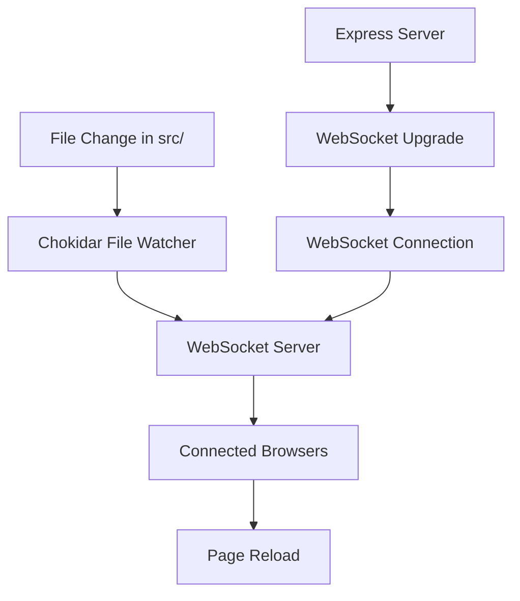
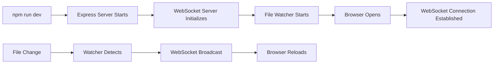

# WebSocket-Based Hot Reloading Architecture

## Implementation Status: ✅ COMPLETE

This document describes the **implemented and working** WebSocket-based hot reloading system for StaticJS. The system has been successfully deployed and replaces the previous complex two-stage development workflow.

## Architecture Overview

The hot reloading system consists of three main components:

1. **WebSocket Server** - Handles client connections and broadcasts reload messages
2. **File Watcher** - Monitors source files for changes using Chokidar
3. **Client Script** - JavaScript client that connects to WebSocket and handles reloads

### Simplified Development Flow


## Current Implementation

### 1. WebSocket Server Implementation

**Location**: [`server/src/utils/websocket.ts`](server/src/utils/websocket.ts:1)

**Key Features**:
- WebSocket server attached to HTTP server on `/ws` path
- Client connection management with ping/pong health checks
- Broadcast system for reload messages to all connected clients
- Automatic cleanup of dead connections

**Implementation**:
```typescript
// WebSocket server attached to existing HTTP server
import { WebSocketServer, WebSocket } from 'ws';

export const initializeWebSocketServer = (httpServer: HttpServer): WebSocketServer | null => {
    wss = new WebSocketServer({ 
        server: httpServer,
        path: '/ws'
    });
    // ... connection handling
};
```

### 2. File Watcher System

**Location**: [`server/src/utils/fileWatcher.ts`](server/src/utils/fileWatcher.ts:1)

**Features**:
- Chokidar-based file watching with debouncing (300ms)
- Smart reload type detection based on file extensions
- Runtime cache invalidation for source file changes
- Watches: `src/**/*`, `package.json`, `vite.config.js`, `tsconfig.json`, `eslint.config.js`

**Reload Types**:
- **Style reload**: `.css`, `.scss`, `.sass`, `.less` files
- **Page reload**: `.tsx`, `.jsx`, `.ts`, `.js` files  
- **Full reload**: `.json`, config files
- **Asset reload**: Images, fonts, etc.

### 3. Hot Reload Middleware

**Location**: [`server/src/middleware/hotReload.ts`](server/src/middleware/hotReload.ts:1)

**Purpose**:
- Serves hot reload client script at `/hot-reload-client.js`
- Injects client script into HTML responses (development only)
- Handles path resolution for client script loading

**Key Features**:
- Robust path resolution that works from any directory
- Multiple injection strategies for different HTML structures
- Development-only activation with proper caching headers

## File Watching System Design

### 1. File Watcher Configuration

**Technology**: Chokidar (already in dependencies)
**Watch Targets**:
- `src/**/*` - All source files
- `package.json` - Dependency changes
- `vite.config.js` - Configuration changes
- `tsconfig.json` - TypeScript configuration
- `eslint.config.js` - ESLint configuration

**Watch Strategy**:
```javascript
const watcher = chokidar.watch([
    'src/**/*',
    'package.json',
    'vite.config.js',
    'tsconfig.json',
    'eslint.config.js'
], {
    ignored: /node_modules/,
    ignoreInitial: true,
    persistent: true,
    awaitWriteFinish: {
        stabilityThreshold: 100,
        pollInterval: 50
    }
});
```

### 2. Change Detection Logic

**File Types**:
- **React Components** (`.tsx`, `.jsx`): Trigger page reload
- **Styles** (`.css`, `.scss`): Trigger style refresh
- **Configuration** (`.json`, `.js`): Trigger full reload
- **Assets** (images, fonts): Trigger asset refresh

**Debouncing**: 300ms delay to handle rapid file changes

### 3. Build Integration

**Development Mode**:
- Skip full build process for most changes
- Use Vite's existing transformation for JavaScript
- Only rebuild when necessary (config changes)
- Runtime cache invalidation for source file changes

**Change Types**:
```javascript
const changeHandlers = {
    'component': () => broadcastReload('page'),
    'style': () => broadcastReload('style'),
    'config': () => broadcastReload('full'),
    'asset': () => broadcastReload('asset')
};
```

## Client-Side Implementation

### 1. Client Script

**Location**: [`server/src/static/hot-reload-client.js`](server/src/static/hot-reload-client.js:1)

**Key Features**:
- Pure JavaScript implementation (no TypeScript compilation needed)
- Auto-reconnection with exponential backoff
- Visual status indicator and reload notifications
- Scroll position preservation across reloads
- Multiple reload strategies based on file type

### 2. Connection Management

**Features**:
- WebSocket connection to `ws://localhost:port/ws`
- Automatic reconnection on connection loss (max 10 attempts)
- Ping/pong health checks
- Visual connection status indicator

### 3. Reload Strategies

**Style Reload**: 
- Reloads CSS links with cache busting
- Handles CSS-in-JS via Vite invalidation events

**Page Reload**: 
- Full page reload with scroll position preservation
- Uses sessionStorage to restore scroll position

**Asset Reload**: 
- Updates image sources with cache busting parameters

**Full Reload**: 
- Clears browser caches and performs complete reload

**Client Script Structure**:
```javascript
function HotReloadClient() {
    this.ws = null;
    this.reconnectAttempts = 0;
    this.maxReconnectAttempts = 10;
    this.reconnectDelay = 1000;
    this.isConnected = false;
    
    this.init();
}

HotReloadClient.prototype.connect = function() {
    var protocol = window.location.protocol === 'https:' ? 'wss:' : 'ws:';
    var wsUrl = protocol + '//' + window.location.host + '/ws';
    this.ws = new WebSocket(wsUrl);
    // ... event handlers
};
```

## Simplified Development Workflow

### 1. Development Commands

**Updated Scripts** (`package.json`):
```json
{
    "scripts": {
        "dev": "NODE_ENV=development tsx server/index.js",
        "build": "bt-staticjs build",
        "start": "npm run build && NODE_ENV=production tsx server/index.js"
    }
}
```

### 2. Development Flow



### 3. Development vs Production Separation

**Development Mode** (`NODE_ENV=development`):
- WebSocket server active
- File watching enabled
- Hot reload client injected
- Runtime rendering with Vite transformation
- No caching headers

**Production Mode** (`NODE_ENV=production`):
- WebSocket server disabled
- File watching disabled
- No client script injection
- Static file serving only
- Proper caching headers

## File Structure

### Implementation Files
```
server/
├── src/
│   ├── utils/
│   │   ├── websocket.ts          # ✅ WebSocket server implementation
│   │   └── fileWatcher.ts        # ✅ File watching logic
│   ├── middleware/
│   │   └── hotReload.ts          # ✅ Hot reload middleware
│   └── static/
│       └── hot-reload-client.js  # ✅ Client-side JavaScript (converted from TS)
```

### Key Changes Made
- **Client script converted**: `hot-reload-client.ts` → `hot-reload-client.js`
- **Path resolution improved**: Robust directory traversal to find script
- **TypeScript compilation removed**: Client script is now pure JavaScript
- **WebSocket integration**: Fully integrated with Express server
- **File watching**: Chokidar-based with smart reload detection

### Dependencies
- `ws` - WebSocket server implementation ✅
- `chokidar` - File watching ✅
- No additional dependencies required

## Troubleshooting

### Common Issues Fixed

#### 1. TypeScript Syntax Errors in Browser
**Problem**: Original TypeScript client script caused syntax errors when served to browsers.

**Solution**: Converted [`hot-reload-client.ts`](server/src/static/hot-reload-client.js:1) to pure JavaScript, eliminating compilation issues.

**Symptoms**:
- Browser console errors about TypeScript syntax
- Hot reload client failing to initialize
- WebSocket connection not establishing

#### 2. Path Resolution Issues
**Problem**: Client script path resolution failed when running from different directories.

**Solution**: Implemented robust path resolution in [`hotReload.ts`](server/src/middleware/hotReload.ts:23) that traverses up the directory tree to find the project root.

**Symptoms**:
- "Script not found" errors in server logs
- Hot reload client script returning 404
- Different behavior when running from subdirectories

#### 3. WebSocket Connection Failures
**Problem**: WebSocket connections failing due to incorrect URL construction or server configuration.

**Solution**: 
- Proper WebSocket server initialization in [`websocket.ts`](server/src/utils/websocket.ts:30)
- Robust connection handling with auto-reconnection
- Health checks with ping/pong

**Symptoms**:
- WebSocket connection errors in browser console
- Hot reload not triggering on file changes
- Connection status indicator showing disconnected

### Debugging Tips

1. **Check WebSocket Connection**: Look for the green status indicator in top-right corner
2. **Monitor Console**: WebSocket messages are logged with `[HotReload]` prefix
3. **Verify File Watching**: File changes should log in server console with `[FileWatcher]` prefix
4. **Test Script Loading**: Visit `/hot-reload-client.js` directly to verify script loads

### Performance Optimizations

- **Debounced File Watching**: 300ms debounce prevents excessive reload triggers
- **Connection Health Checks**: Ping/pong every 30 seconds removes dead connections
- **Smart Reload Types**: Different strategies based on file type minimize unnecessary full reloads
- **Scroll Position Preservation**: Maintains user scroll position across page reloads

## Benefits Achieved

### 1. Simplified Development
- ✅ Single command: `npm run dev`
- ✅ Faster startup time
- ✅ No complex script chains
- ✅ Clear error messages

### 2. Better Performance
- ✅ Direct file watching (no intermediate builds)
- ✅ Faster reload times (< 300ms)
- ✅ Reduced memory usage
- ✅ Fewer running processes

### 3. Improved Developer Experience
- ✅ Instant feedback on changes
- ✅ Visual reload indicators
- ✅ Better error handling
- ✅ Scroll position preservation

### 4. Cleaner Architecture
- ✅ Single responsibility per component
- ✅ Clear separation of concerns
- ✅ TypeScript throughout server code
- ✅ Pure JavaScript client (no compilation needed)

### 5. Production Safety
- ✅ No development overhead in production
- ✅ Environment-based feature toggling
- ✅ Proper static file serving
- ✅ Security-focused configuration

This implementation provides a robust, efficient, and maintainable hot reloading system that significantly improves the development experience while maintaining production performance and security.